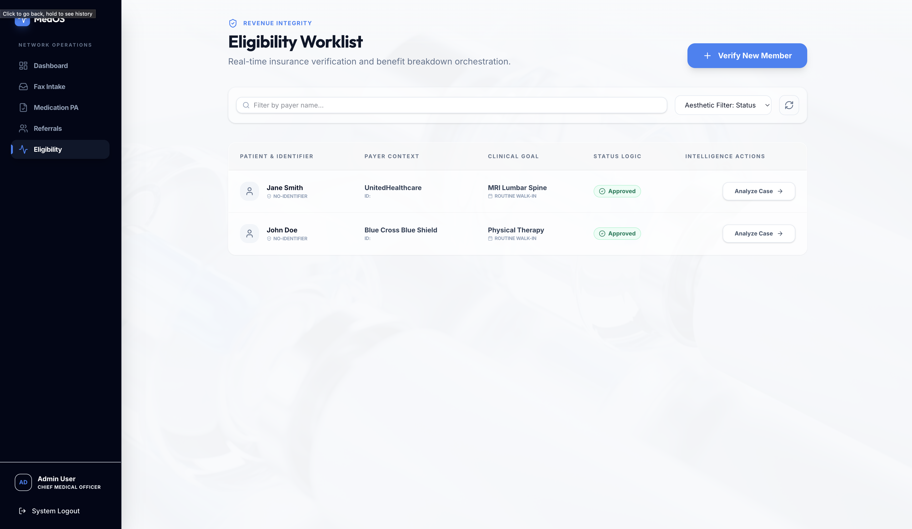
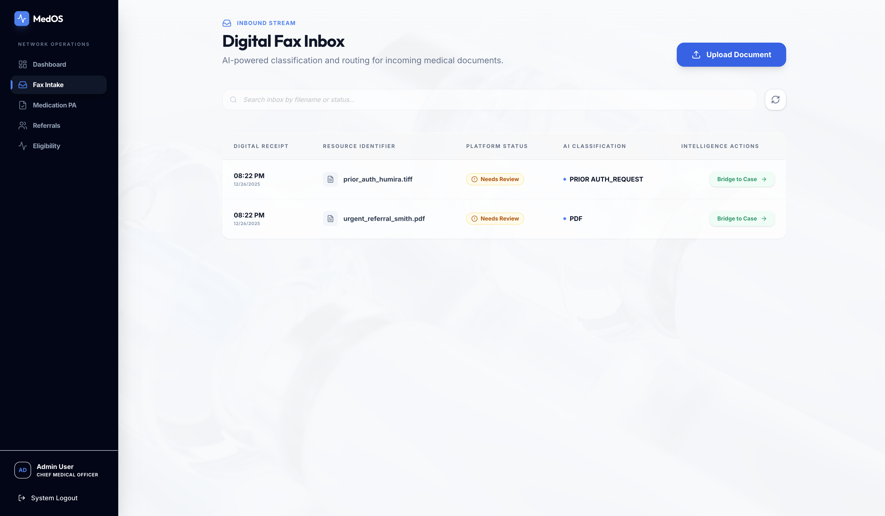
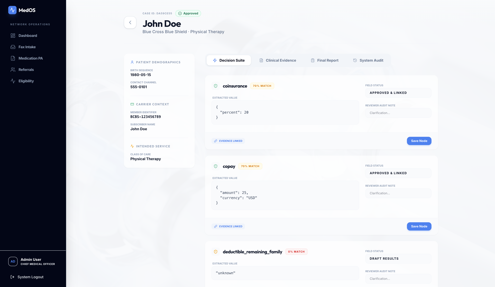
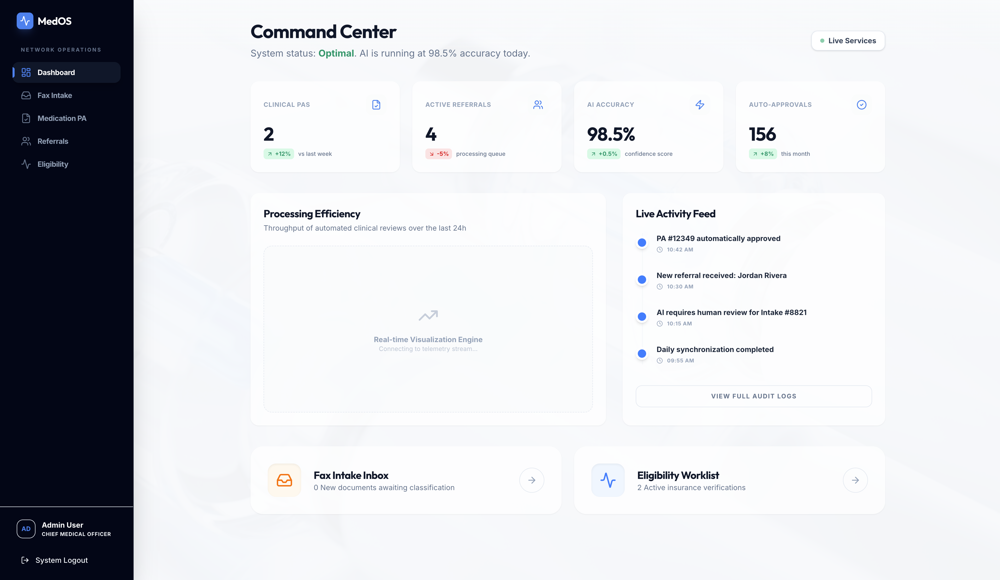

# MedOS: The Operating System for Healthcare Operations

> **Transforming administrative chaos into intelligent clinical workflows.**

MedOS (formerly E&B Copilot) is an enterprise-grade AI platform designed to automatically dismantle the administrative barriers between patients and care. By streamlining referral management, insurance verification, and prior authorization, we empower healthcare teams to operate at the top of their license.

---

## 🛑 The Problem: Administrative Burden

Healthcare operations are drowning in manual tasks disguised as "work":
*   **Unstructured Chaos:** Faxes, emails, and web portals flood intake teams with unclassified documents faster than humans can read them.
*   **Revenue Leakage:** Up to 20% of patient referrals are lost due to data entry errors, missing information, or slow follow-up.
*   **Staff Burnout:** Clinical staff spend hours on hold with payers or hunting through 500-page PDFs effectively doing data entry.

## ⚡ The Solution: Intelligent Automation

MedOS provides a unified **"Intelligence Layer"** that sits between your team and the chaos.

### 1. Intelligent Intake ("Air Traffic Control")
Automated document classification and routing.
*   **Auto-Labeling:** Instantly distinguishes between an "Urgent MRI Request" and a "Junk Fax".
*   **The Bridge:** One-click conversion from a raw PDF to a fully structured patient case—no typing required.

### 2. The Verification Decision Suite ("The Sleuth")
Instant clinical context and faster approvals.
*   **AI Extraction:** LLM-backed extraction of benefits, copays, and policy limitations.
*   **Confidence Scoring:** Visual "Green/Red" indicators allow staff to verify cases in seconds, not minutes.
*   **Audit Trail:** Every AI decision is tracked and reviewable.

### 3. Referral Growth Engine ("The Revenue Driver")
Capture every patient opportunity.
*   **Triage & Qualify:** Immediate validation of provider networks and specialties.
*   **Scheduling Module:** Integrated booking workflow to lock in appointments instantly.

---

## 📸 Platform Walkthrough

### 1. The Intake Command Center
*Manage all inbound channels (Fax, Email, Upload) in one view.*




### 2. The Decision Suite
*Review extracted benefits and clinical data side-by-side.*





### 3. Analytics & Growth
*Real-time visibility into referral volume and processing times.*




---

## 🛠️ Local Setup

### Prerequisites
- Python 3.11+
- Node.js 18+
- Docker & Docker Compose

### 1. Quick Start
```bash
# 1. Start Infrastructure
cd infra && docker compose up -d

# 2. Setup Backend & Seed Data
cd ../backend
python3.11 -m venv .venv && source .venv/bin/activate
pip install -r requirements.txt
python scripts/seed.py  # (Credentials: admin@medos.com / admin123)

# 3. Start Services
./start.sh  # (Or run API + Worker individually)
```

### 2. Frontend
```bash
cd frontend
npm install && npm run dev
```

---

## 🛡️ Enterprise Security
*   **RBAC**: Granular roles for Admins, Reviewers, and Schedulers.
*   **Encryption**: Best-in-class encryption for data at rest and in transit.
*   **Audit**: Immutable logs for every user action and AI inference as required by HIPAA standards.
