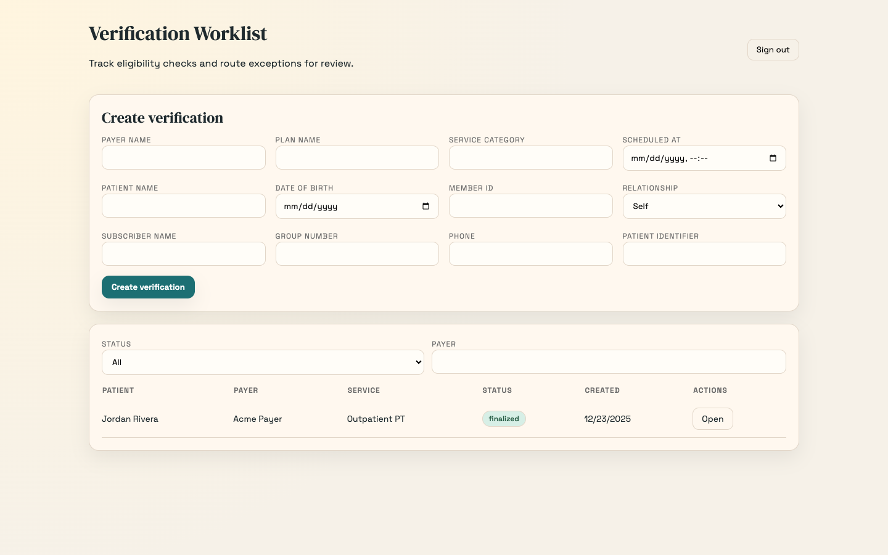

# Eligibility & Benefits Verification Copilot (E&B Copilot)

## Why this exists

Outpatient clinics spend hours verifying insurance eligibility and benefits before visits. The process is repetitive, error-prone, and hard to audit, leading to denials, delayed collections, and rework.

E&B Copilot reduces that burden by producing evidence-backed benefits summaries, routing low-confidence cases to human review, and maintaining a full audit trail of every action.

## What the MVP delivers

- Worklist to track verifications by status, payer, and due date.
- Evidence ingestion (connector response, uploaded PDF/image, or manual transcript).
- Structured extraction with citations for every field.
- Human review workflow (approve, edit, or set unknown with reason).
- Immutable audit log for every case action.
- Benefits Summary PDF report for finalized cases.

## Demo flow (end-to-end)

1. Log in and open the worklist.
2. Create or open a verification case.
3. Run verification (mock connector) or upload evidence.
4. Review extracted fields and finalize.
5. Download the PDF report and view the audit trail.

## Screenshots

### Login


### Worklist




## Architecture (MVP)

- **Frontend**: Next.js (TypeScript)
- **API**: FastAPI
- **Background jobs**: Celery + Redis
- **Database**: PostgreSQL
- **Object storage**: S3-compatible (MinIO for local)
- **Report rendering**: ReportLab (deterministic PDF template)
- **LLM boundary**: schema-constrained extraction with evidence pointers

## Local setup (venv)

```bash
python -m venv .venv
source .venv/bin/activate
pip install -r backend/requirements.txt
```

Copy `.env.example` to `.env` and adjust values as needed (use `localhost` for local DBs).

### Migrations

```bash
cd backend
alembic upgrade head
```

### Run API

```bash
cd backend
uvicorn app.main:app --reload
```

### Run worker

```bash
cd backend
celery -A app.workers.celery_app.celery_app worker -l info
```

### Run frontend

```bash
cd frontend
npm install
npm run dev
```

Set `NEXT_PUBLIC_API_BASE_URL` if the API is not on `http://localhost:8000`.

## Docker Compose (optional)

```bash
docker compose -f infra/docker-compose.yml up --build
```

## Seed demo data

```bash
source .venv/bin/activate
python scripts/seed.py
```

Demo credentials:
- `admin@demo.com` / `password123`
- `reviewer@demo.com` / `password123`
- `scheduler@demo.com` / `password123`

## Project structure

- `frontend/`: Next.js UI (worklist, case detail, review, report)
- `backend/`: FastAPI service, models, migrations, and APIs
- `backend/app/workers/`: Celery background jobs
- `infra/`: Docker Compose stack
- `public/`: Screenshots for docs
- `scripts/`: Seed data and demo helpers
